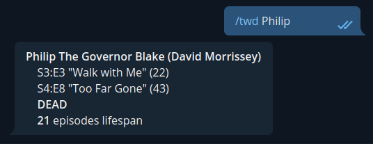

# TheWalkingDeadBot

Made for The Walking Dead series fans.
It's a fully comprehensive database containing information about episodes and characters and it comes with the right tools to make queries.

## Dependencies

The python3 program requires the `Levenshtein` package and you need to create the database from the dump I included in the project. The following commands will do everything you need.

```bash
pip3 install Levenshtein
chmod +x twd.py
cat twd-dump.db | sqlite3 twd.db
```
You are good to go. Look at the next section to see how you can query the DB.


## Querist [twd.py](/twd.py)

It's a simple python script to interrogate the database and obtain informations, but what you can do?

```
$ ./twd.py --help
usage: twd.py [-h] [--character CHARACTER] [--season SEASON] [--episode EPISODE] [--json] [--html]

Returns informations about The Walking Dead characters

options:
  -h, --help            show this help message and exit
  --character CHARACTER
                        returns the character's first seen date and his death
  --season SEASON       returns all the new characters and all the deaths of the season
  --episode EPISODE     returns all new characters and all the deaths in the episode
  --json                if you want a JSON output format
  --html                if you want a HTML output format (helpful with Telegram bot's output)
```

We can simply interrogate the database to obtain quick infos about the character:
```
$ ./twd.py --character "hershel greene"

Hershel Greene:
  First:  S2 ep.2 "Bloodletting"
  Death:  S4 ep.8 "Too Far Gone"
  Status: Dead
```

We can use it to generate a json response (APIs freaks I hear you) with the `--json` flag:


```bash
$ ./twd.py --character Rick --json |jq

{
  "name": "Rick Grimes",
  "actor": "Andrew Lincoln",
  "fs_numep": 1,
  "fs_season": 1,
  "fs_episode": 1,
  "fs_release": "31 Oct 10",
  "fs_eptitle": "Days Gone Bye",
  "d_numep": 0,
  "d_season": 0,
  "d_episode": 0,
  "d_release": "",
  "d_eptitle": "",
  "lifespan": 177,
  "status": "Alive"
}
```
<br>

> **Warning**
> SpOiLeRs ahead

<br>

**Ooooor** we could ask infos about new characters and character's deaths for a single season!


```bash
$ ./twd.py --season 2 --json

{"first_appearances": [{"n": 2, "characters": ["Maggie Rhee Greene", "Beth Greene", "Hershel Greene", "Patricia", "Otis", "Jimmy"]}, {"n": 3, "characters": ["Annette Greene", "Shawn Greene"]}, {"n": 8, "characters": ["Tony", "Dave"]}, {"n": 9, "characters": ["Nate", "Randall Culver", "Sean"]}], "deaths": [{"n": 1, "characters": ["Sophia Peletier"]}, {"n": 2, "characters": ["Annette Greene", "Shawn Greene"]}, {"n": 3, "characters": ["Otis"]}, {"n": 8, "characters": ["Tony", "Dave"]}, {"n": 9, "characters": ["Nate", "Sean"]}, {"n": 11, "characters": ["Dale Horvath"]}, {"n": 12, "characters": ["Shane Walsh", "Randall Culver"]}]}
```

**Aaaand** do the same for a single episode...

```bash
$ ./twd.py --episode Bloodletting
First Appearances in "Bloodletting" S2x2:
  - Maggie Rhee Greene
  - Beth Greene
  - Hershel Greene
  - Patricia
  - Otis
  - Jimmy

Deaths in in "Bloodletting" S2x2:
  - Annette Greene
  - Shawn Greene
```

<br>

### The Database

If you are wandering where and how I filled the database with the correct infos, I found everything in the [fandom wiki TV Series Character page](https://walkingdead.fandom.com/wiki/TV_Series_Characters), and yes, I inserted them pseudo manually (made a python script to avoid using sqlite3 CLI). It took days.

```bash
$ sqlite3 twd.db "SELECT COUNT(*) FROM Character"
515
```
There are two tables, `Character` and `Episodes`. The Column `FirstAppearance` and `Death` contain the link to the `Episode.EpisodeNumber` which identifies the episode in the series itself.

**Character**
>```sql
>CREATE TABLE Character (
>    Id integer PRIMARY KEY AUTOINCREMENT,
>    Actor varchar,
>    Name varchar,
>    FirstAppearance integer,
>    Death integer,
>    UNIQUE(Actor, Name)
>);
>```


**Episode**
>```sql
>CREATE TABLE Episodes (
>    EpisodeNumber INTEGER PRIMARY KEY,
>    Season INTEGER,
>    EpisodeInSeason INTEGER,
>    ReleaseDate TEXT,
>    EpisodeTitle TEXT
>);

An example here for our beloved [Hershel (Greene)](https://walkingdead.fandom.com/wiki/Hershel_Greene_(TV_Series)):
image.png
```bash
$ sqlite3 twd.db "SELECT * FROM Character WHERE Name LIKE 'Hershel G%'"
34|Scott Wilson|Hershel Greene|8|43

$ sqlite3 twd.db "SELECT * FROM Episodes WHERE EpisodeNumber = 8 OR EpisodeNumber = 43"
8|2|2|23 Oct 11|Bloodletting
43|4|8|01 Dec 13|Too Far Gone
```

<br>

### Telegram Bot?

Did I make a telegram bot out of it?

|  |
|:--:|
| <b>naaaaaaah</b> |


---


## Why?

_Why_ all this effort? _Why_ the project on github? _Why_ anything else?
At a certain point, I just wanted to know when The Governor would have f*\****g died. The rest is history (and overcomplicated project ideas).

The cool answer is that I didn't find anything similar so I did it to help others that could make use of the database I created.

!!! Note Sometimes online wikies are not enough, sometimes you just need **APIs**.

---

## Issues

#### character prioritization (open)
Given how it's programmed, twd.py always tries to give you the best answer based on name matching ([Levenshtein function](https://maxbachmann.github.io/Levenshtein/levenshtein.html)). 

```python
# Return the best result for character contained in res (using the levenshtein function above)
def best_result(character_name, res):
	distances = []
	for i in range(0, len(res)):
		distances.append(levenshtein_distance(character_name, res[i]['name']))

	return res[distances.index(min(distances))]
```

However, sometimes when you search a certain character, the program gives you one that has the best match but perhaps is less (or way less) important than the one you had in mind that simply has the same name.

Example:

```bash
$ ./twd.py --character Noah
Noah:
  First:  S3 ep.11 "I Ain't a Judas"
  Death:  S3 ep.11 "I Ain't a Judas"
  Status: Dead

$ sqlite3 twd.db "SELECT * FROM Character WHERE Name LIKE 'Noah%'"
64|Parker Wierling|Noah|30|30
148|Tyler James Williams|Noah|55|65
```

The Tyler James Williams' Noah appears in ten times more episodes than the Parker Wierling's so it should be more important.